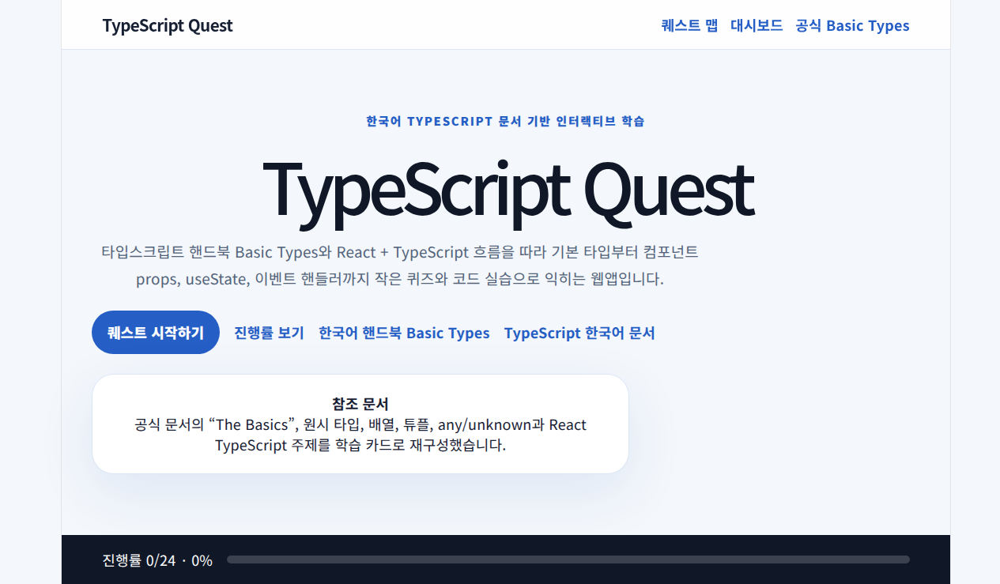
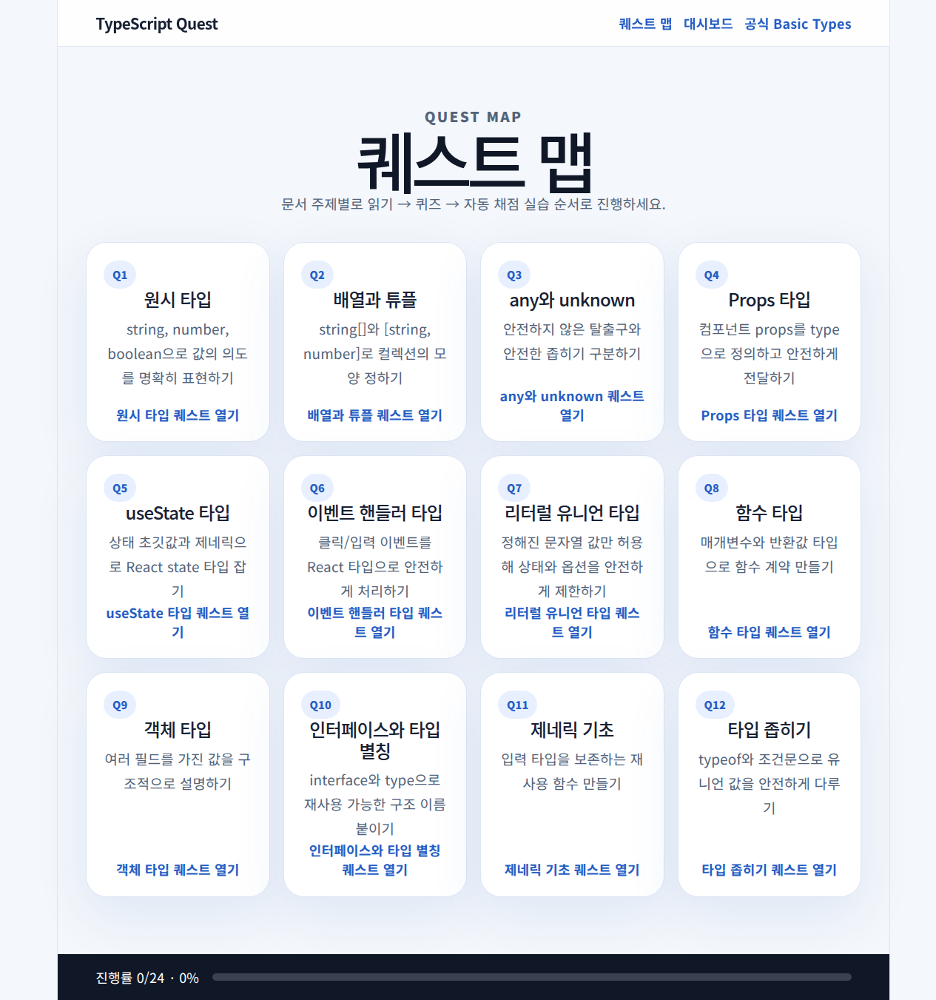
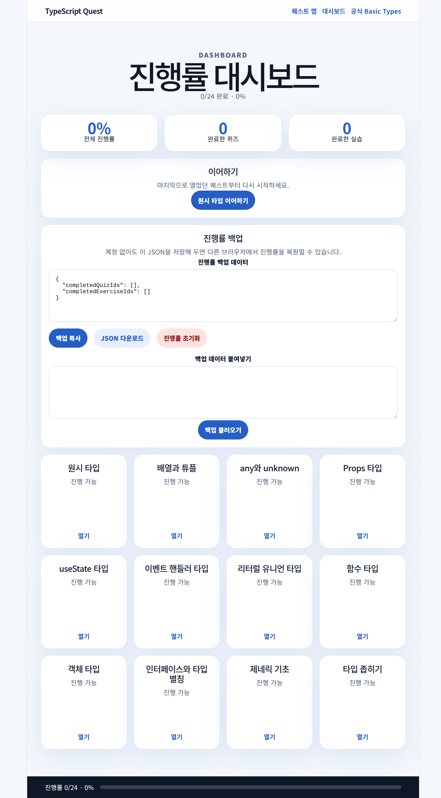

# TypeScript Quest

[](https://github.com/ptec07/typescript-quest/actions/workflows/ci.yml)
[](https://typescript-quest.vercel.app)

TypeScript Quest는 TypeScript 공식 한국어 문서 흐름을 따라 학습하는 React + Vite + TypeScript 웹앱입니다. React Quest처럼 챕터별 퀘스트, 퀴즈, 실습, 진행률 대시보드를 제공합니다.

- 배포: https://typescript-quest.vercel.app
- GitHub: https://github.com/ptec07/typescript-quest
- 참고 문서: https://www.typescriptlang.org/ko/docs/handbook/2/basic-types.html
- 한국어 문서: https://typescript-kr.github.io/

## 스크린샷

### 홈



### 퀘스트 맵



### 진행률 백업



## 주요 기능

- 한국어 TypeScript 학습 퀘스트 맵
- TypeScript 공식 문서 흐름 기반 챕터
  - 원시 타입
  - 배열과 튜플
  - any와 unknown
  - 리터럴 유니언 타입
  - 함수 타입
  - 객체 타입
  - 인터페이스와 타입 별칭
  - 제네릭 기초
  - 타입 좁히기
- React + TypeScript 챕터
  - Props 타입
  - useState 타입
  - 이벤트 핸들러 타입
- 챕터별 체크포인트 퀴즈
- Sandpack 기반 실습 미리보기
- 정적 자동 채점, 힌트, 정답 보기, 초기화
- localStorage 기반 진행률 저장
- 계정 없는 JSON 진행률 백업/복원
  - 백업 복사
  - JSON 다운로드
  - 진행률 초기화
- 진행률 대시보드와 이어하기 링크
- Vercel SPA 배포 설정
- GitHub Actions CI로 테스트, 빌드, 린트 검증

## 로컬 실행

```bash
npm install
npm run dev
```

기본 Vite 주소는 다음과 같습니다.

```text
http://localhost:5173
```

## 검증 명령

```bash
npm test -- --run
npm run build
npm run lint
```

현재 기준 검증 결과:

```text
Test Files  4 passed (4)
Tests       16 passed (16)
```

## CI

GitHub Actions 워크플로는 `.github/workflows/ci.yml`에 있습니다.

- trigger: `push`, `pull_request` to `main`
- Node.js: `24`
- steps: `npm ci` → `npm test -- --run` → `npm run build` → `npm run lint`

## 주요 경로

- `/` — 랜딩 페이지
- `/quests` — 퀘스트 맵
- `/dashboard` — 진행률 대시보드와 JSON 백업/복원
- `/quest/:slug` — 레슨 페이지
- `/quest/:slug/practice` — 실습 페이지

## 프로젝트 구조

```text
.github/
└── workflows/
    └── ci.yml
docs/
└── screenshots/
    ├── dashboard-backup.png
    ├── home.png
    └── quest-map.png
src/
├── App.tsx
├── App.css
├── App.test.tsx
├── ci-config.test.ts
├── sandpack-lazy.test.ts
├── vercel-config.test.ts
├── content/
│   └── lessons.ts
├── features/
│   └── progress/
│       ├── progress.ts
│       └── useProgress.ts
└── test/
    └── setup.tsx
```

## 진행률 저장

브라우저 localStorage에 다음 키로 저장합니다.

```ts
typescript-quest-progress
```

진행률은 서버나 로그인 없이 브라우저에 저장됩니다. 대시보드에서 JSON을 복사하거나 다운로드해 다른 브라우저에 붙여넣어 복원할 수 있습니다.

## 배포

Vercel 배포용 `vercel.json`이 포함되어 있습니다. React Router deep link가 새로고침에서도 동작하도록 SPA rewrite가 설정되어 있습니다.

```bash
npm run build
npx vercel --prod
```

현재 프로덕션 배포는 `Ready` 상태이며 대표 URL은 다음과 같습니다.

```text
https://typescript-quest.vercel.app
```
